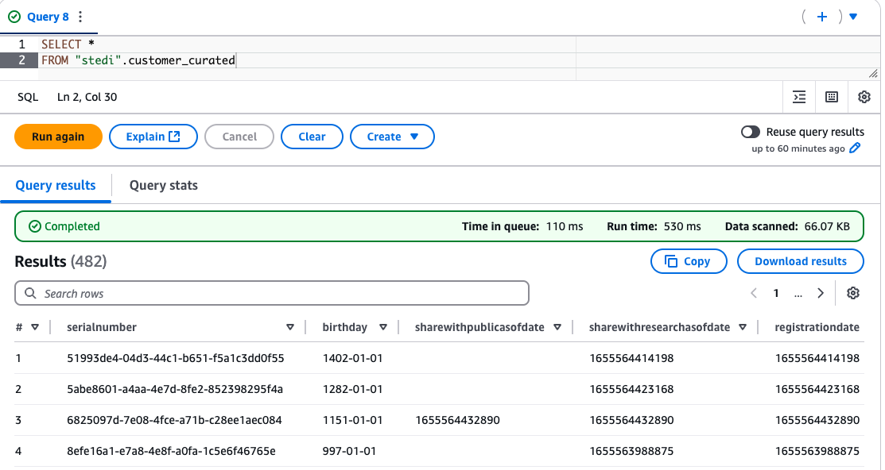

# Project: Data Lake and Spark on AWS - STEDI Human Balance Analytics

## 1. **Project Description**

The **STEDI Human Balance Analytics** solution is designed to help users perform the **STEDI balance exercise**. The STEDI team has developed a hardware device called the **STEDI Step Trainer**, which:
- Trains users to perform balance exercises.
- Contains sensors that collect data to train a machine learning algorithm for step detection.
- Works with a companion mobile app that collects customer data and interacts with the device sensors.

The **Step Trainer** functions as a _motion sensor_ that records the _distance of detected objects_, while the mobile app uses the phone's _accelerometer_ to detect motion along the X, Y, and Z axes.

### **Objective**:
The STEDI team aims to use the motion sensor data to train a machine learning model capable of detecting steps accurately in real-time. To achieve this, early adopters of the device have agreed to _share their data for research purposes_, while ensuring **privacy** remains a **key priority**. Only data from these consenting customers' Step Trainer and accelerometer should be used for training the machine learning model.

Building a **data engineering solution** to **extract data** from the STEDI Step Trainer sensors and the mobile app, and organize it into a **data lakehouse solution on AWS**. This will enable Data Scientists to use the curated data to train machine learning models.

> Note: This project is part of the [Data Engineering with AWS Nanodegree Program](https://www.udacity.com/course/data-engineer-nanodegree--nd027).

---

## 2. **Project Structure**

```
UDACITY-SPARK-DATALAKE-PROJECT
├── job_scripts                     # Spark Jobs Python Scripts 
│   └── ...
├── screenshots                      # Screenshots of AWS Athena and Glue Studio 
│   └── job_results_athena
    └── ...
└── sql                              # A few table are created by AWS Athena
    └── ...
```

---

## 4. **Solution**

The solution involves building a **data lakehouse** for the STEDI data, which organizes the data into three zones:

- **Landing Zone**: Contains raw ingested data.
- **Trusted Zone**: Holds cleaned, filtered, or enriched data from the landing zone.
- **Curated Zone**: Includes business-level aggregates created from the trusted zone.

To achieve this, I used **AWS Glue** to create several **Spark Jobs** for performing **ETL** operations and constructing the lakehouse.

The following sections provide an overview of the solution, including configuration details, Spark Jobs, and example SQL queries. Some parts are presented step-by-step for clarity and learning purposes.

---

## 5. **Upload Raw Data to a S3 bucket & Create Database:**

The _project data_ (JSON files) from the original github repository are uploaded to a **S3 bucket**. This **ingested data** will correspond to our ***landing zone***.

On AWS, open the **CloudShell terminal (AWS CLI)** and execute the steps below:

```
# create a S3 bucket
aws s3 mb s3://stedi-lakehouse

# download the github repo with the project data
git clone https://github.com/udacity/nd027-Data-Engineering-Data-Lakes-AWS-Exercises.git

# copy `customer` data
cd nd027-Data-Engineering-Data-Lakes-AWS-Exercises/project/starter/
aws s3 cp customer/landing/  s3://stedi-lakehouse/customer/landing/ --recursive

# copy `accelerometer` data
aws s3 cp accelerometer/landing/ s3://stedi-lakehouse/accelerometer/landing/ --recursive

# copy `step trainer` data
aws s3 cp step_trainer/landing/ s3://stedi-lakehouse/step_trainer/landing/ --recursive
```

### **Create Database**

1. Navigate to **Glue Dashboard > Data Catalog > Databases**.
2. Click **Add Database**.
   - **Database Name**: `stedi`
3. Click **Create Database**.

---

## 6. **Landing Zone**

The Landing Zone is where the raw data for customers, accelerometer, and step trainer are stored in an AWS S3 bucket.

- Navigate to **AWS Athena Dashboard**.
- Open the **Query Editor** from the side menu.
- See the following DDL SQL commands to create tables for the Landing Zone:
   - [customer_landing.sql](./sql/customer_landing.sql).
   - [accelerometer_landing.sql](./sql/accelerometer_landing.sql).
   - [step_trainer_landing.sql](./sql/step_trainer_landing.sql).

On **AWS Athena**, I performed a **full table scan** on three tables to analyze the data effectively. These queries helped in understanding the structure and content of the data, which guided the ETL process.


### 6.1 **Customer Landing Data**
- `SELECT * FROM customer_landing`
    - 956 rows

 <br/>


### 6.2 **Accelerometer Landing Data**
- `SELECT * FROM accelerometer_landing;`
  - 81,273 rows

 <br/>

**Step Trainer Landing Data**
- `SELECT * FROM step_trainer_landing;`
  - 28,680 rows

 <br/>

---

## 7. **Trusted Zone**

A Spark job is used to transform customer data from the LANDING zone to the TRUSTED zone. 

I utilized **Glue Studio** to create ETL jobs for extracting, transforming, and loading data from S3. The **Visual ETL** tool in Glue Studio made it easy to design the job visually. The generated _PySpark_ code is saved in the [`./job_scripts` folder](./job_scripts/).

### 7.1 **Glue Job Scripts**

1. **[`customer_landing_to_trusted.py`](./job_scripts/Customer_Landing_To_Trusted.py)**:  
Transfers customer data from the "Landing" to the "Trusted" zone and filters customers who have agreed to share their data with researchers.


2. **[`accelerometer_landing_to_trusted.py`](./job_scripts/accelerometer_landing_to_trusted.py)**:  
   Transfers accelerometer data from the "Landing" to the "Trusted" zone.  
   - Joins `customer_trusted` with `accelerometer_landing`.  
   - Filters accelerometer readings for customers who have agreed to share data with researchers.  
   - Removes fields from `customer_trusted`.  
   - Eliminates duplicate rows.

3. **[`step_trainer_landing_to_trusted.py`](./job_scripts/Step_Trainer_Landing_To_Trusted.py)**:  
Transfers Step Trainer data from the "Landing" to the "Trusted" zone.  
- Joins `customer_curated` with `step_trainer_landing` on `serialnumber`.  
- Filters readings to exclude records where `serialnumber1` is null or empty.  
- Removes unnecessary fields from `customer_curated`.  
- Eliminates duplicate records.


### 7.2 **Customer Trusted Data**
- `SELECT * FROM customer_trusted`
    - 482 rows

 <br/>


### 7.3 **Accelerometer Trusted Data**
- `SELECT * FROM accelerometer_trusted;`
  - 40,981 rows

 <br/>

### 7.4 **Step Trainer Trusted Data**
- `SELECT * FROM step_trainer_trusted;`
  - 14,460 rows

 <br/>

---

## 8. **Curated Zone**

In the **Curated Zone**, I created AWS Glue jobs to perform further transformations to meet the specific needs of advanced analysis and machine learning. This zone includes curated datasets tailored for specific use cases.

### 8.1 **Glue Job Scripts**

1. **[`customer_trusted_to_curated.py`](./job_scripts/Customer_TRUSTED_to_CURATED.py)**:  
 Transfers customer data from the "Trusted" to the "Curated" zone.  
    - Joins `customer_trusted` with `accelerometer_trusted` on the `email` field.  
    - Filters out accelerometer readings to include only customers who have agreed to share their data for research.  
    - Removes unnecessary accelerometer fields from the resulting data.  
    - Eliminates duplicate rows to ensure data integrity.  

2. **[`Machine_Learning_Curated.py`](./job_scripts/Machine_Learning_Curated.py)**:  
    Transfers Step Trainer data from the "Trusted" zone to the "Curated" zone.  
    - Joins `accelerometer_trusted` with `step_trainer_trusted` on the `timestamp` and `sensorreadingtime` fields.  
    - Selects only the matching records where accelerometer readings align with step trainer data.  

### 8.2 **Customer Curated Data**
- `SELECT * FROM customers_curated;`  
  - 482 rows


 <br/>


### 8.3 **Machine Learning Curated Data**
- `SELECT * FROM machine_learning_curated;`  
  - 43,681 rows


 <br/>
---
